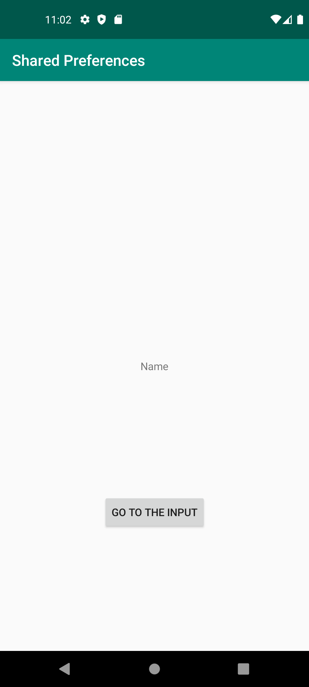
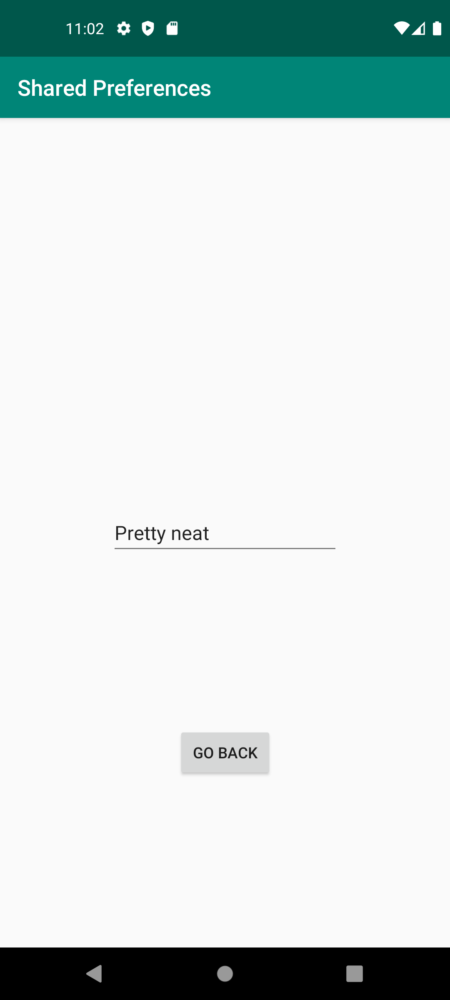

Appen fungerar lätt så att det finns en textview som visar ett default text när man startar appen

när man klickar på knappen kommer man till en ny activity med en EditText och en knapp. 

klickar man på knappen så kommer texten att visas i textviewn på första activityn


Koden för MainActivity funkar så att du har Sharedpreference som kommer åt texten som blir ändrad senare i SecondActivity och en knapp som tar dig dit

```java
    SharedPreferences preferences = getSharedPreferences("EditText", MODE_PRIVATE);

    Button button = findViewById(R.id.mainButton);
    button.setOnClickListener(v -> {
        startActivity(new Intent(this, SecondActivity.class));
    });
```

i SecondActivity sen så har du en EditText och en knapp som sparar texten i sharedpreference "EditText" och sen stänger activityn
```java
    Button button = findViewById(R.id.secondButton);
        EditText editText = findViewById(R.id.editTextText);
        preferencesEditor = getSharedPreferences("EditText", MODE_PRIVATE).edit();

        button.setOnClickListener(v -> {
        preferencesEditor.putString("EditText", editText.getText().toString());
        preferencesEditor.apply();
        finish();
        });
```

Det som händer då är att i Stings.xml ändras EditText till det som står i EditTexten
```xml
<resources>
    <string name="app_name">Shared Preferences</string>
    <string name="EditText">Name</string>
</resources>
```

Och i MainActivity när vi 'resumar' så ändras textviewn till det som står i sharedpreference "EditText" eller default om det inte finns något
```java
    protected void onResume() {
        super.onResume();
        TextView textView = findViewById(R.id.textView);
        textView.setText(preferences.getString("EditText", "default"));
        }
```